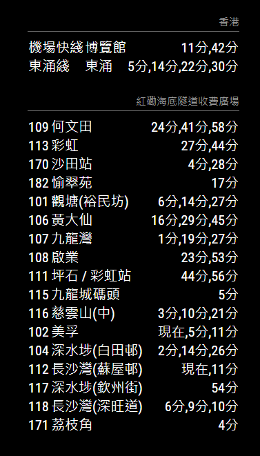

# MMM-HK-Transport-ETA Module

Estimated Time of Arrival (ETA) for the Hong Kong Transport. It uses the API provided by [DATA.GOV.HK](https://data.gov.hk/) and support several Hong Kong transport.

This module aims to be the replacement the [MMM-HK-KMB](https://github.com/winstonma/MMM-HK-KMB) and [MMM-HK-Transport](https://github.com/winstonma/MMM-HK-Transport) modules.

## Screenshot



## Data Extraction Script

This module includes a data extraction script for MTR Bus routes in the `scripts/` directory. The script extracts route and station information from the MTR Bus Data Dictionary PDF and converts it to JSON format for use in the module.

For detailed information on how to use the script, please refer to [scripts/README.md](scripts/README.md).

## Prerequisite

A working installation of [MagicMirror<sup>2</sup>](https://github.com/MichMich/MagicMirror)

## Dependencies

- npm
- [js-kmb-api](https://github.com/miklcct/js-kmb-api)

## Installation

To add this module, go to MagicMirror folder and run the following command

```bash
cd modules
git clone https://github.com/winstonma/MMM-HK-Transport-ETA.git
cd MMM-HK-Transport-ETA
npm install
```

## Usage

To use this module, add it to the modules array in the `config/config.js` file:

```javascript
modules: [
	{
		module: "MMM-HK-Transport-ETA",
		position: "top_right",
		config: {
			// See 'Configuration options' for more information.
			transportETAProvider: "mtr",
			sta: "Hong Kong",
		},
	},
];
```

## Configuration options

The following properties can be configured:

### General options

| Option                 | Description                                                                                                                                                                                                 |
| ---------------------- | ----------------------------------------------------------------------------------------------------------------------------------------------------------------------------------------------------------- |
| `transportETAProvider` | Which ETA provider should be used. <br><br> **Possible values:** `mtr`, `kmb`, `ctb`, `mtrbus`, `lrt` or `gmb`<br> **Default value:** `mtr`                                                                        |
| `reloadInterval`       | How often does the content needs to be fetched? (Milliseconds) <br><br> **Possible values:** `1000` - `86400000` <br> **Default value:** `60000` (1 minute)                                                 |
| `updateInterval`       | How often do you want to display a relative time? (seconds). If set to `0`, the relative time would not be displayed.<br><br> **Possible values:** `0` - `60000` <br> **Default value:** `5000` (5 seconds) |
| `animationSpeed`       | Speed of the update animation. (Milliseconds) <br><br> **Possible values:** `0` - `5000` <br> **Default value:** `2500` (2.5 seconds)                                                                       |
| `showHeader`           | Display the header. <br><br> **Possible values:** `true` or `false` <br> **Default value:** `false`                                                                                                         |

## Supported Transport Providers

For MTR, KMB, CTB and MTR Bus configuration, please use the [MMM-HK-Transport-ETA-Configurator](https://winstonma.github.io/MMM-HK-Transport-ETA-Configurator/). This web-based tool simplifies the process of finding the correct configuration values for your desired transport lines and stations.

### Light Rail Transit (LRT)

| Option | Description                                                                                                                                                                                                                     |
| ------ | ------------------------------------------------------------------------------------------------------------------------------------------------------------------------------------------------------------------------------- |
| `sta`  | Which LRT station <br><br> **Possible values:** Please use to **eng_name** or **chi_name** of the supported list of lrt station, for example `Lung Mun` or `龍門` |

### Green Minibuses (GMB)

| Option | Description                                                                                                                                                                                                                                                                                                                                                                                                                                                                                                                                                                                                                                                                                                                                                                                                                                                                                                                              |
| ------ | ---------------------------------------------------------------------------------------------------------------------------------------------------------------------------------------------------------------------------------------------------------------------------------------------------------------------------------------------------------------------------------------------------------------------------------------------------------------------------------------------------------------------------------------------------------------------------------------------------------------------------------------------------------------------------------------------------------------------------------------------------------------------------------------------------------------------------------------------------------------------------------------------------------------------------------------- |
| `area` | Which area does the GMB belongs <br><br> **Possible values:**<br>- `HKI` for Hong Kong Island Line<br>- `KLN` for Kowloon Line<br>- `NT` for New Territories Line                                                                                                                                                                                                                                                                                                                                                                                                                                                                                                                                                                                                                                                                                                                                                                        |
| `line` | Which Bus line <br><br> **Possible values:**<br>- [Supported list of bus routes for Hong Kong Island GMB](https://data.etagmb.gov.hk/route/HKI)<br>- [Supported list of bus routes for Kowloon GMB](https://data.etagmb.gov.hk/route/KLN)<br>- [Supported list of bus routes for New Territories GMB](https://data.etagmb.gov.hk/route/NT)                                                                                                                                                                                                                                                                                                                                                                                                                                                                                                                                                                                               |
| `sta`  | Which GMB station <br><br> **Possible values:** Please follow the steps below to obtain the stop name<br>1. Form the URL `https://codebeautify.org/jsonviewer?url=https://data.etagmb.gov.hk/route/{area}/{line}` using the `area` and `line` in the above config.<br>&nbsp;&nbsp;&nbsp;&nbsp;&nbsp;&nbsp;For example if you want to obtain a specific stop of Hong Kong Island GMB Line 12, then your URL is `https://codebeautify.org/jsonviewer?url=https://data.etagmb.gov.hk/route/HKI/12`.<br>&nbsp;&nbsp;&nbsp;&nbsp;&nbsp;&nbsp;In this page you will obtain **route_id**<br>2. Then form the URL `https://codebeautify.org/jsonviewer?url=https://data.etagmb.gov.hk/route-stop/{route_id}/1` using the **route_id** obtained from the previous step, then you would obtain a list of stops.<br>&nbsp;&nbsp;&nbsp;&nbsp;&nbsp;&nbsp;In this page you would obtain **stop_id** of your desired stop. Place it in `sta` would do. |
