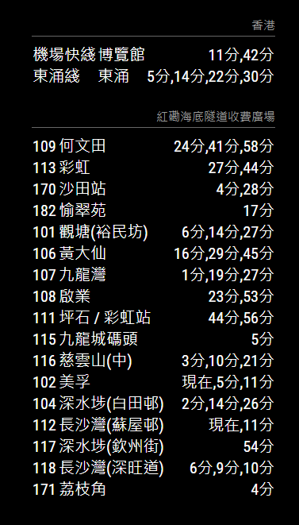

# MMM-HK-Transport-ETA Module

Estimated Time of Arrival (ETA) for the Hong Kong Transport. It uses the API provided by [DATA.GOV.HK](https://data.gov.hk/) and support several Hong Kong transport.

This module aims to be the replacement the [MMM-HK-KMB](https://github.com/winstonma/MMM-HK-KMB) and [MMM-HK-Transport](https://github.com/winstonma/MMM-HK-Transport) modules.

## Screenshot



## Data Extraction Script

This module includes a data extraction script for MTR Bus routes in the `scripts/` directory. The script extracts route and station information from the MTR Bus Data Dictionary PDF and converts it to JSON format for use in the module.

For detailed information on how to use the script, please refer to [scripts/README.md](scripts/README.md).

## Prerequisite

A working installation of [MagicMirror<sup>2</sup>](https://github.com/MichMich/MagicMirror)

## Dependencies

- npm
- [js-kmb-api](https://github.com/miklcct/js-kmb-api)

## Installation

To add this module, go to MagicMirror folder and run the following command

```bash
cd modules
git clone https://github.com/winstonma/MMM-HK-Transport-ETA
cd MMM-HK-Transport-ETA
npm install
```

## Usage

To use this module, add it to the modules array in the `config/config.js` file:

```javascript
	{
		module: "MMM-HK-Transport-ETA",
		position: "top_right",
		config: {
			// See 'Configuration options' for more information.
			transportETAProvider: "mtr",
			sta: "Hong Kong",
		},
	},
```

## Configuration options

The following properties can be configured:

### General options

| Option                 | Description                                                                                                                                                                                                 |
| ---------------------- | ----------------------------------------------------------------------------------------------------------------------------------------------------------------------------------------------------------- |
| `transportETAProvider` | Which ETA provider should be used. <br><br> **Possible values:** `mtr`, `kmb`, `ctb`, `mtrbus`, `lrt` or `gmb`<br> **Default value:** `mtr`                                                                        |
| `reloadInterval`       | How often does the content needs to be fetched? (Milliseconds) <br><br> **Possible values:** `1000` - `86400000` <br> **Default value:** `60000` (1 minute)                                                 |
| `updateInterval`       | How often do you want to display a relative time? (seconds). If set to `0`, the relative time would not be displayed.<br><br> **Possible values:** `0` - `60000` <br> **Default value:** `5000` (5 seconds) |
| `animationSpeed`       | Speed of the update animation. (Milliseconds) <br><br> **Possible values:** `0` - `5000` <br> **Default value:** `2500` (2.5 seconds)                                                                       |
| `showHeader`           | Display the header. <br><br> **Possible values:** `true` or `false` <br> **Default value:** `false`                                                                                                         |

## Supported Transport Providers

For MTR, KMB, CTB, MTR Bus, GMB and LRT configuration, please use the [MMM-HK-Transport-ETA-Configurator](https://winstonma.github.io/MMM-HK-Transport-ETA-Configurator/). This web-based tool simplifies the process of finding the correct configuration values for your desired transport lines and stations.
